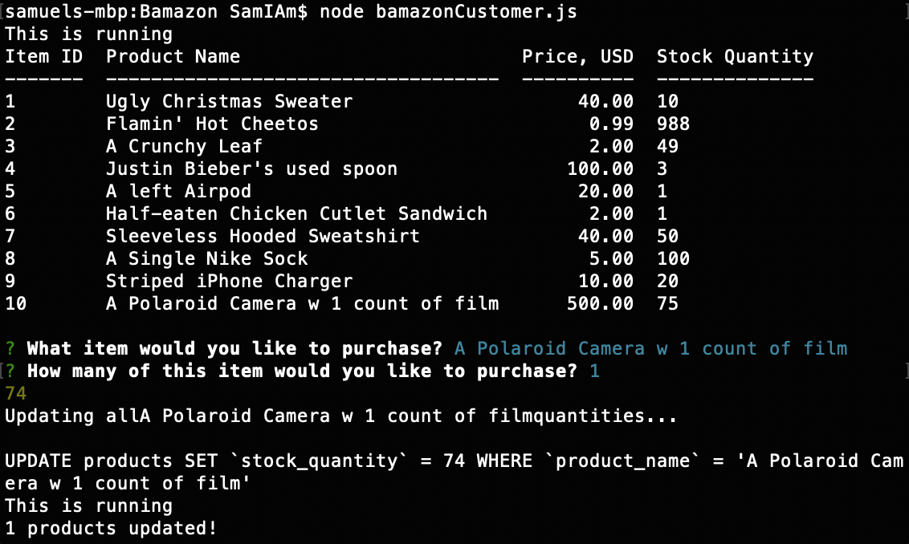

# Bamazon

# Problem
Attempting to run an e-commerce application/website and have to complete all of the transactions manually? This Bamazon app has all of the functionality of what you would need for such a business. From a user point-of-view to a manager, to even a supervisor, this application handles all of your needs to grab, visualize and manipulate data in a database (specifically from an e-commerce standpoint).

# Overview
For this application, we took the general skeleton for how a website/app like Amazon functions, and used it to create our own "storefront" under the name ***Bamazon***. From the customer's POV, the app will take in orders from users and deplete stock from the store's inventory. Additional functionality include tracking product sales across store departments and providing summary of the highest-grossing items and departments.

# Instructions
### Customer.js
This is a Node.js application and thus has to be run in the bash/terminal on your computer.

In order to use this app, you must type ```node bamazonCustomer.js``` in your terminal window.

Upon initialization, the app will present you with a table of products in the database, with columns for product id #, name, price, and stock quantity. The app will then prompt you, as a customer, to pick an item to purchase from the table. It will then ask you how much of that item you would like to purchase. If there is not sufficient quantity for the item in question, you will not be allowed to purchase the item and it will bring you back to the initial "products" table. If there *is* sufficient quantity, the # quantity you selected to be purchased will be depleted from the stock inventory and the database will be updated accordingly. An example run of the app is shown in the screenshot below.



### Manager.js
In order to use this app, you must type ```node bamazonManager.js``` in your terminal window.

### Supervisor.js
In order to use this app, you must type ```node bamazonSupervisor.js``` in your terminal window.

## Technology
The [mysql npm package](https://www.npmjs.com/package/mysql) was used to parse through the database and manipulate and grab the data to be presented to the user.

The [easy-table npm package](https://www.npmjs.com/package/easy-table) was used to present this data in a clear viewing window for the user to visualize and execute functions on.

These functions were executed with the help of the [inquirer npm package](https://www.npmjs.com/package/inquirer), which presents users with questions to be answered in the terminal window. Based on how the user answers these questions, certain functions will be executed (in this case, on the data).

## Role
Lead Developer